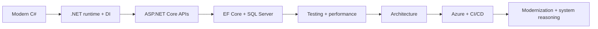

# .NET Vault

<div align="center">

**Practical C#/.NET backend engineering knowledge for production systems**

[](./docs/CSharp/BackendCSharp.md)
[](./docs/DotNet/DependencyInjection.md)
[](./docs/AspNetCore/RestApiDesign.md)
[](./docs/SQLServer/QueryOptimization.md)
[](./docs/Azure/AzureFundamentals.md)

</div>

## Table of Contents

- [Purpose](#purpose)
- [Quick Navigation](#quick-navigation)
- [Technologies](#technologies)
- [Learning Roadmap](#learning-roadmap)
- [Repository Structure](#repository-structure)
- [Engineering Focus](#engineering-focus)
- [Contributing](#contributing)
- [License](#license)

## Purpose

.NET Vault is my practical knowledge base for building and maintaining enterprise backend systems with C#, .NET, ASP.NET Core, EF Core, SQL Server, Azure, and production delivery workflows.

The notes are written around hands-on engineering concerns: evolving REST contracts, diagnosing database performance, modernizing legacy applications without breaking behavior, establishing test seams, migrating source control, and making releases observable and reversible.

> [!IMPORTANT]
> This repository does not claim that one architecture fits every system. Each recommendation should be evaluated against workload, risk, team ownership, and current platform documentation.

## Quick Navigation

| Build and operate | Modernize and improve | Prepare and communicate |
| --- | --- | --- |
| [REST API design](./docs/AspNetCore/RestApiDesign.md) | [Legacy modernization](./docs/DotNet/LegacyModernization.md) | [.NET interview guide](./docs/InterviewQuestions/DotNetBackendGuide.md) |
| [EF Core data flow](./docs/EntityFrameworkCore/DbContextAndDataFlow.md) | [SQL optimization](./docs/SQLServer/QueryOptimization.md) | [SOLID decisions](./docs/Architecture/SOLID.md) |
| [Authentication and authorization](./docs/AspNetCore/AuthenticationAuthorization.md) | [TFVC/TFS to GitHub](./docs/Git/TfvcToGitHubMigration.md) | [Curated resources](./docs/Resources/EngineeringResources.md) |

Browse the complete [documentation index](./docs/README.md).

## Technologies

`C#` · `.NET` · `ASP.NET Core` · `REST APIs` · `Entity Framework Core` · `SQL Server` · `Azure` · `Azure DevOps` · `GitHub` · `xUnit` · `CI/CD`

## Learning Roadmap



1. Build explicit C# contracts and understand dependency lifetimes.
2. Follow a request through middleware, authorization, application logic, EF Core, and SQL Server.
3. Add tests at the policy and integration boundaries.
4. Diagnose performance with correlated application and database evidence.
5. Apply architecture patterns only where they reduce meaningful change risk.
6. Automate one-artifact delivery with health verification and rollback.

## Repository Structure

```text
dotnet-vault/
├── README.md
├── docs/
│   ├── CSharp/                  ├── DotNet/
│   ├── AspNetCore/              ├── EntityFrameworkCore/
│   ├── SQLServer/               ├── Azure/
│   ├── Architecture/            ├── DesignPatterns/
│   ├── Performance/             ├── Testing/
│   ├── Git/                     ├── InterviewQuestions/
│   └── Resources/
├── diagrams/                    # Diagram catalog and conventions
├── examples/                    # Example design and quality standards
└── images/                      # Repository visual-asset guidance
```

## Engineering Focus

- Production behavior over textbook definitions.
- Small, reversible modernization steps over risky rewrites.
- Explicit API, identity, data, and transaction boundaries.
- Evidence-driven SQL and application performance work.
- Tests that protect behavior without freezing implementation.
- CI/CD that promotes an immutable artifact and verifies service health.

## Contributing

1. Keep each change focused on one engineering decision.
2. Use generic business examples and never include employer or proprietary information.
3. Preserve the practical page structure and link to primary sources.
4. Verify code, Markdown links, Mermaid syntax, and technical claims.
5. Explain the production trade-off; do not add unexplained snippets or link dumps.

## License

No license has been granted yet. The content remains all rights reserved until a license is selected explicitly.

---

<div align="center">

Maintained as a focused record of practical .NET backend engineering judgment.

</div>
