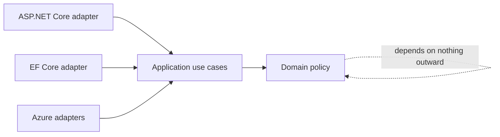

# Clean Architecture for Backend Services

[← Documentation index](../README.md) · [Repository home](../../README.md)

## Overview

Clean Architecture protects business policy from delivery and persistence details by directing source-code dependencies inward.

> [!NOTE]
> This guidance is intentionally practical. Confirm version-sensitive behavior against current primary documentation.

## Why It Matters in Real Projects

The value is testable decision logic and replaceable infrastructure. The cost is extra boundaries, so each boundary should protect a real source of change.

## Core Concepts

| # | Engineering principle |
| ---: | --- |
| 1 | Domain code expresses business invariants without framework dependencies. |
| 2 | Application use cases coordinate work through ports. |
| 3 | Adapters translate HTTP, SQL, messaging, and vendor APIs. |

## Practical Explanation

An order use case depends on repository and payment ports; ASP.NET Core and EF Core remain outer adapters.

## Enterprise / Backend Use Case

In a production service, I would define the boundary first, make ownership visible, add telemetry around the failure modes, and introduce the change in a reversible slice. The specific design should follow workload, data sensitivity, deployment constraints, and the maintenance cost for the team that owns it.

## Production Considerations

- Define expected failure behavior, timeout or transaction boundaries, and recovery.
- Make logs and traces useful without recording credentials or sensitive business data.
- Verify the design with representative concurrency and data volume.



## C# / .NET Example

```csharp
public sealed class PlaceOrderHandler(IOrderRepository orders, IPaymentGateway payments)
{
    public async Task<OrderId> HandleAsync(PlaceOrder command, CancellationToken cancellationToken)
    {
        var order = Order.Create(command.CustomerId, command.Lines);
        await payments.AuthorizeAsync(order.Payment, cancellationToken);
        await orders.AddAsync(order, cancellationToken);
        return order.Id;
    }
}
```

## Best Practices

- Keep transport and ORM types outside the domain.
- Model use cases around business intent.
- Enforce dependency direction with project references and tests.

## Common Mistakes

- Creating layers that only forward calls.
- Putting repository interfaces around every query.
- Allowing domain code to depend on controllers, DbContext, or cloud SDKs.

## Interview Questions

1. What is the dependency rule?
2. When is Clean Architecture too much?
3. Where should transaction boundaries live?

<details>
<summary>How to answer well</summary>

State the governing rule, use a concrete backend example, explain the main trade-off, and describe how you would verify the decision in production.

</details>

## References

- [.NET architecture guides](https://learn.microsoft.com/dotnet/architecture/)
- [Microsoft .NET application architecture guidance](https://learn.microsoft.com/dotnet/architecture/)
