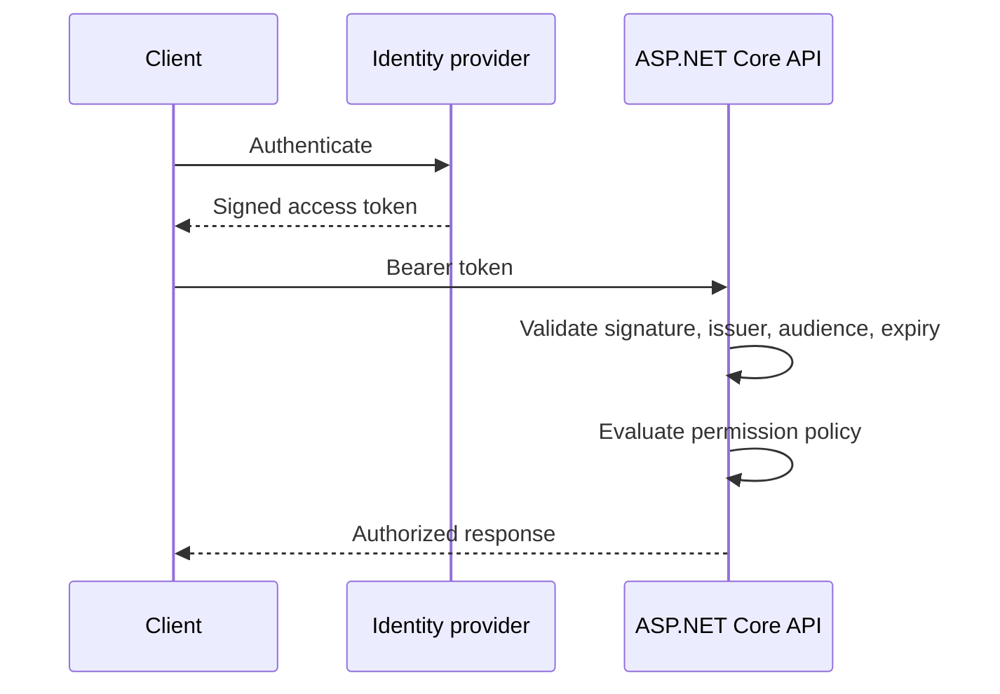

# JWT Authentication and Policy Authorization

[← Documentation index](../README.md) · [Repository home](../../README.md)

## Overview

Authentication establishes identity; authorization evaluates whether that identity may perform a specific action. JWT bearer tokens are signed credentials and must be validated as untrusted input.

> [!NOTE]
> This guidance is intentionally practical. Confirm version-sensitive behavior against current primary documentation.

## Why It Matters in Real Projects

Security failures often come from incomplete validation or coarse role checks. Backend authorization should express capabilities and, where needed, ownership of the requested resource.

## Core Concepts

| # | Engineering principle |
| ---: | --- |
| 1 | Validate signature, issuer, audience, and lifetime. |
| 2 | Policies group reusable permission requirements. |
| 3 | Resource-based authorization evaluates both caller and target resource. |

## Practical Explanation

A claims API accepts a token from a trusted identity provider and requires a claims.write permission before mutation.

## Enterprise / Backend Use Case

In a production service, I would define the boundary first, make ownership visible, add telemetry around the failure modes, and introduce the change in a reversible slice. The specific design should follow workload, data sensitivity, deployment constraints, and the maintenance cost for the team that owns it.

## Production Considerations

- Define expected failure behavior, timeout or transaction boundaries, and recovery.
- Make logs and traces useful without recording credentials or sensitive business data.
- Verify the design with representative concurrency and data volume.



## C# / .NET Example

```csharp
builder.Services.AddAuthorization(options =>
    options.AddPolicy("CanWriteClaims", policy =>
        policy.RequireClaim("permission", "claims.write")));

app.MapPost("/claims", CreateClaim)
   .RequireAuthorization("CanWriteClaims");
```

## Best Practices

- Use short-lived tokens and managed key rotation.
- Keep sensitive data out of token payloads.
- Test missing, expired, wrong-audience, and underprivileged tokens.

## Common Mistakes

- Treating a decoded token as a validated token.
- Using only UI checks to protect operations.
- Embedding changing business permissions permanently in long-lived tokens.

## Interview Questions

1. What does a JWT signature protect?
2. When is resource authorization required?
3. How do authentication schemes and policies interact?

<details>
<summary>How to answer well</summary>

State the governing rule, use a concrete backend example, explain the main trade-off, and describe how you would verify the decision in production.

</details>

## References

- [ASP.NET Core documentation](https://learn.microsoft.com/aspnet/core/)
- [Microsoft .NET application architecture guidance](https://learn.microsoft.com/dotnet/architecture/)
