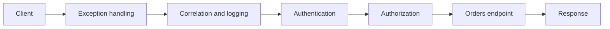

# ASP.NET Core Request Pipeline

[← Documentation index](../README.md) · [Repository home](../../README.md)

## Overview

The request pipeline is an ordered set of middleware and endpoints. Ordering is part of application correctness, especially for errors, authentication, authorization, and telemetry.

> [!NOTE]
> This guidance is intentionally practical. Confirm version-sensitive behavior against current primary documentation.

## Why It Matters in Real Projects

Production incidents can arise from a single misplaced middleware: missing correlation, unauthenticated authorization checks, or exception responses that bypass consistent handling.

## Core Concepts

| # | Engineering principle |
| ---: | --- |
| 1 | Middleware can act before and after the next component. |
| 2 | A middleware can short-circuit and produce the response. |
| 3 | Endpoint routing attaches metadata used by authorization and filters. |

## Practical Explanation

An order API creates correlation context, handles unexpected exceptions consistently, authenticates the caller, and enforces endpoint policies.

## Enterprise / Backend Use Case

In a production service, I would define the boundary first, make ownership visible, add telemetry around the failure modes, and introduce the change in a reversible slice. The specific design should follow workload, data sensitivity, deployment constraints, and the maintenance cost for the team that owns it.

## Production Considerations

- Define expected failure behavior, timeout or transaction boundaries, and recovery.
- Make logs and traces useful without recording credentials or sensitive business data.
- Verify the design with representative concurrency and data volume.



## C# / .NET Example

```csharp
app.UseExceptionHandler("/error");
app.UseHttpsRedirection();
app.UseAuthentication();
app.UseAuthorization();
app.MapControllers();
```

## Best Practices

- Place global exception handling early.
- Keep business rules out of middleware.
- Verify ordering with integration tests for protected and failing endpoints.

## Common Mistakes

- Calling the next middleware after writing a response.
- Putting authorization before authentication.
- Logging request bodies without redaction and size limits.

## Interview Questions

1. Why does middleware order matter?
2. When should middleware short-circuit?
3. How do endpoint filters differ from middleware?

<details>
<summary>How to answer well</summary>

State the governing rule, use a concrete backend example, explain the main trade-off, and describe how you would verify the decision in production.

</details>

## References

- [ASP.NET Core documentation](https://learn.microsoft.com/aspnet/core/)
- [Microsoft .NET application architecture guidance](https://learn.microsoft.com/dotnet/architecture/)
