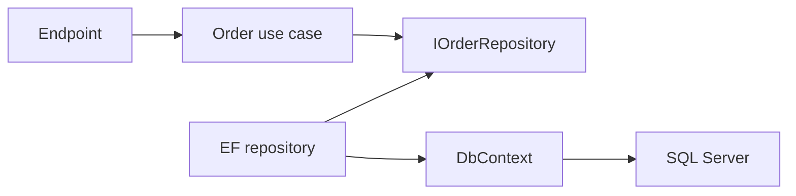

# Repository Pattern Without the Generic CRUD Trap

[← Documentation index](../README.md) · [Repository home](../../README.md)

## Overview

A repository can protect aggregate persistence and domain language. A generic CRUD wrapper often hides useful EF Core behavior without creating a meaningful boundary.

> [!NOTE]
> This guidance is intentionally practical. Confirm version-sensitive behavior against current primary documentation.

## Why It Matters in Real Projects

In backend systems, the pattern works when it expresses use-case needs and preserves aggregate consistency, not when it mirrors every table.

## Core Concepts

| # | Engineering principle |
| ---: | --- |
| 1 | Repositories operate on aggregate roots. |
| 2 | Queries can use dedicated read models instead of generic repositories. |
| 3 | The unit-of-work boundary coordinates persistence. |

## Practical Explanation

An order repository loads the aggregate required for a state transition; reporting queries use projections optimized for their consumers.

## Enterprise / Backend Use Case

In a production service, I would define the boundary first, make ownership visible, add telemetry around the failure modes, and introduce the change in a reversible slice. The specific design should follow workload, data sensitivity, deployment constraints, and the maintenance cost for the team that owns it.

## Production Considerations

- Define expected failure behavior, timeout or transaction boundaries, and recovery.
- Make logs and traces useful without recording credentials or sensitive business data.
- Verify the design with representative concurrency and data volume.



## C# / .NET Example

```csharp
public interface IOrderRepository
{
    Task<Order?> GetForUpdateAsync(OrderId id, CancellationToken cancellationToken);
    Task AddAsync(Order order, CancellationToken cancellationToken);
}
```

## Best Practices

- Name operations in domain language.
- Keep IQueryable inside the persistence boundary.
- Avoid a repository when direct DbContext use is already the appropriate boundary.

## Common Mistakes

- Creating IRepository<T> with universal CRUD.
- Returning partially loaded aggregates.
- Hiding transaction ownership across multiple SaveChanges calls.

## Interview Questions

1. Why can generic repositories be harmful with EF Core?
2. How does a repository differ from a query service?
3. Who should own SaveChanges?

<details>
<summary>How to answer well</summary>

State the governing rule, use a concrete backend example, explain the main trade-off, and describe how you would verify the decision in production.

</details>

## References

- [.NET architecture guides](https://learn.microsoft.com/dotnet/architecture/)
- [Microsoft .NET application architecture guidance](https://learn.microsoft.com/dotnet/architecture/)
