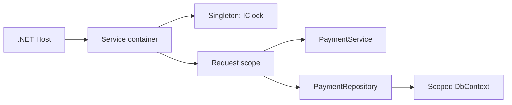

# Dependency Injection and Service Lifetimes

[← Documentation index](../README.md) · [Repository home](../../README.md)

## Overview

Dependency injection is the composition mechanism for .NET applications. The important engineering work is not registration syntax; it is ownership and lifetime design.

> [!NOTE]
> This guidance is intentionally practical. Confirm version-sensitive behavior against current primary documentation.

## Why It Matters in Real Projects

A lifetime mismatch can leak state between requests, retain disposable resources, or fail only under concurrency. These defects are expensive because the code often appears correct in local testing.

## Core Concepts

| # | Engineering principle |
| ---: | --- |
| 1 | Singleton services live for the process and must be thread-safe. |
| 2 | Scoped services normally represent one request or unit of work. |
| 3 | Transient services are created per resolution and should remain lightweight. |

## Practical Explanation

A payment workflow uses a scoped DbContext, a stateless validator, and a process-wide clock without allowing the singleton to capture request state.

## Enterprise / Backend Use Case

In a production service, I would define the boundary first, make ownership visible, add telemetry around the failure modes, and introduce the change in a reversible slice. The specific design should follow workload, data sensitivity, deployment constraints, and the maintenance cost for the team that owns it.

## Production Considerations

- Define expected failure behavior, timeout or transaction boundaries, and recovery.
- Make logs and traces useful without recording credentials or sensitive business data.
- Verify the design with representative concurrency and data volume.



## C# / .NET Example

```csharp
builder.Services.AddSingleton<IClock, SystemClock>();
builder.Services.AddScoped<IPaymentRepository, PaymentRepository>();
builder.Services.AddScoped<PaymentService>();
builder.Services.AddTransient<PaymentValidator>();
```

## Best Practices

- Make required dependencies constructor parameters.
- Validate service registrations during startup.
- Create an explicit scope inside background workers.

## Common Mistakes

- Injecting a scoped repository into a singleton.
- Using IServiceProvider inside business code as a service locator.
- Registering stateful services without documenting ownership.

## Interview Questions

1. Why is a scoped dependency unsafe in a singleton?
2. When should a background service create a scope?
3. How do factory registrations affect disposal?

<details>
<summary>How to answer well</summary>

State the governing rule, use a concrete backend example, explain the main trade-off, and describe how you would verify the decision in production.

</details>

## References

- [.NET documentation](https://learn.microsoft.com/dotnet/)
- [Microsoft .NET application architecture guidance](https://learn.microsoft.com/dotnet/architecture/)
