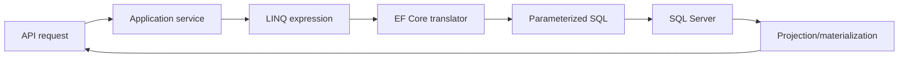

# EF Core DbContext and Data Flow

[← Documentation index](../README.md) · [Repository home](../../README.md)

## Overview

DbContext is a short-lived unit-of-work boundary. It translates LINQ, tracks selected entities, and coordinates a transaction when SaveChanges is called.

> [!NOTE]
> This guidance is intentionally practical. Confirm version-sensitive behavior against current primary documentation.

## Why It Matters in Real Projects

In backend services, context lifetime and query shape affect correctness and capacity. A context shared across work items is neither thread-safe nor a reliable cache.

## Core Concepts

| # | Engineering principle |
| ---: | --- |
| 1 | Tracked entities support change detection and updates. |
| 2 | No-tracking projections reduce work for read models. |
| 3 | SaveChanges groups pending changes in a transaction by default. |

## Practical Explanation

An order query returns a purpose-built summary without loading the aggregate or tracking rows that will never be updated.

## Enterprise / Backend Use Case

In a production service, I would define the boundary first, make ownership visible, add telemetry around the failure modes, and introduce the change in a reversible slice. The specific design should follow workload, data sensitivity, deployment constraints, and the maintenance cost for the team that owns it.

## Production Considerations

- Define expected failure behavior, timeout or transaction boundaries, and recovery.
- Make logs and traces useful without recording credentials or sensitive business data.
- Verify the design with representative concurrency and data volume.



## C# / .NET Example

```csharp
var summary = await dbContext.Orders
    .AsNoTracking()
    .Where(order => order.Id == orderId)
    .Select(order => new OrderSummary(order.Id, order.Status, order.Total))
    .SingleOrDefaultAsync(cancellationToken);
```

## Best Practices

- Use one scoped context per request or explicit unit of work.
- Project only fields needed by the response.
- Inspect generated SQL for important queries.

## Common Mistakes

- Returning IQueryable across architectural boundaries.
- Using Include to load an unbounded graph.
- Attaching request payloads and marking every property modified.

## Interview Questions

1. When should AsNoTracking be used?
2. Is DbContext thread-safe?
3. How does SaveChanges handle transactions?

<details>
<summary>How to answer well</summary>

State the governing rule, use a concrete backend example, explain the main trade-off, and describe how you would verify the decision in production.

</details>

## References

- [EF Core documentation](https://learn.microsoft.com/ef/core/)
- [Microsoft .NET application architecture guidance](https://learn.microsoft.com/dotnet/architecture/)
